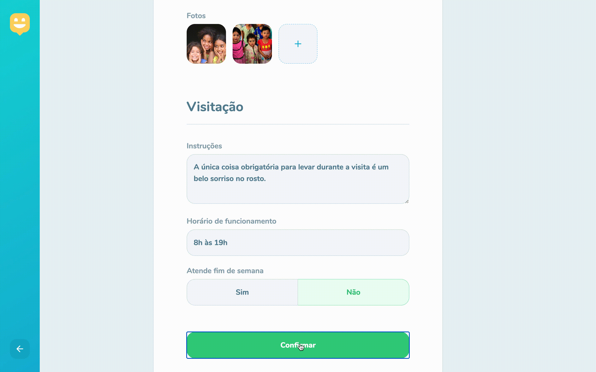
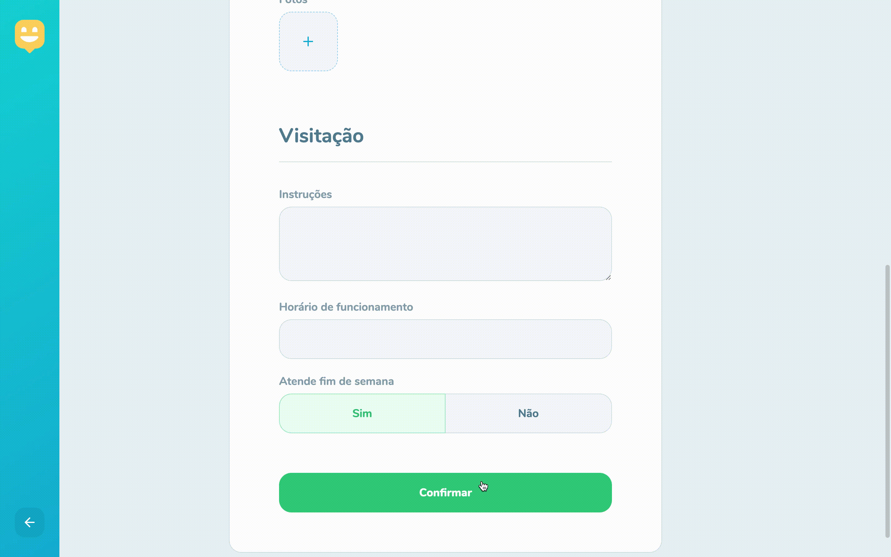

<div align="center">


![web] ![server] ![mobile] ![top_language] ![repo-size] ![license]

### Projeto desenvolvido durante a #NextLevelWeek da [Rocketseat] utilizando as tecnologias **React**, **React Native** e **Node.js**.

</div>

## :bookmark: Sobre

Leve felicidade para o mundo. O **Happy** é uma plataforma que visa conectar pessoas com orfanatos, seu principal intuito é alegrar o dia das crianças através de visitas e trazer informações sobre como realizar a visitação.


## :computer: Tecnologias

O projeto foi desenvolvido com as seguintes tecnologias:

- [Node.js](https://nodejs.org/en/)
- [React](https://reactjs.org)
- [React Native](https://facebook.github.io/react-native/)
- [Expo](https://expo.io/)

## :rocket: A milha extra

Completar a semana de workshops é o primeiro passo para alavancar na direção de nossos objetivos, mas para nos destacar precisamos percorrer a milha extra! Abaixo deixo algumas features que adicionei no projeto e conforme eu for aprimorando conhecimento adicionarei mais.

### Animação na landing page utilizando o Framer Motion:


### Toast notifications na página de criação de orfanatos:




### 

## :wrench: Como utilizar

#### Faça um clone do repositório:

```sh
  $ git clone https://github.com/iancmilan/happy.git
```

#### Backend da aplicação:

```sh
  # backend
  $ cd backend
  # instalando as dependências do projeto
  $ yarn # ou npm install
  # executando as migrações para criação das tabelas do banco de dados
  $ yarn typeorm migration:run

  # executando o servidor
  $ yarn dev # ou npm dev
```
#### Aplicação web:
```sh
  # aplicação web
  $ cd web
  # instalando as dependências do projeto
  $ yarn # ou npm install
  
  # crie uma conta no MapBox(https://account.mapbox.com/) e copie seu token
  
  # adicionando variável de ambiente com o token do MapBox
  $ echo "REACT_APP_MAPBOX_TOKEN=COLE-SEU-TOKEN-AQUI" >> .env

  # executando a aplicação web
  $ yarn start # ou npm start
```
#### Aplicação mobile:
```sh
  # aplicação mobile
  $ cd mobile
  # instalando as dependências do projeto
  $ yarn # ou npm install

  # executando a aplicação mobile
  $ yarn start # ou npm start
```
## :memo: Licença

Esse projeto está sob licensa [MIT](LICENSE).

<!-- Links -->
[Rocketseat]: https://rocketseat.com.br/

<!-- Bagdes -->
[web]: https://img.shields.io/badge/web-React-16bfcb?style=flat-square&labelColor=121214
[server]: https://img.shields.io/badge/server-Node.js-16bfcb?style=flat-square&labelColor=121214
[mobile]: https://img.shields.io/badge/mobile-React%20Native-16bfcb?style=flat-square&labelColor=121214
[top_language]: https://img.shields.io/github/languages/top/iancmilan/happy?style=flat-square&color=16bfcb&labelColor=121214
[license]: https://img.shields.io/github/license/iancmilan/happy?style=flat-square&color=16bfcb&labelColor=121214
[repo-size]: https://img.shields.io/github/repo-size/iancmilan/happy?style=flat-square&color=16bfcb&labelColor=121214
