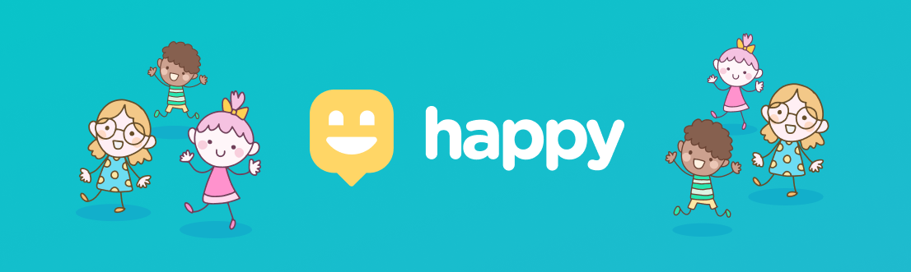

![web] ![top_language] ![repo-size] ![license]

### Projeto que está sendo desenvolvido durante a #NextLevelWeek da [Rocketseat] e utilizara as tecnologias **React**, **React Native** e **Node.js**.

## :bookmark: Sobre

Leve felicidade para o mundo. O **Happy** é uma plataforma que visa conectar pessoas com orfanatos, seu principal intuito é alegrar o dia das crianças através de visitas e trazer informações sobre como realizar a visitação.

## :construction_worker: :construction: Em construção :construction: :construction_worker:

<!-- Links -->
[Rocketseat]: https://rocketseat.com.br/

<!-- Bagdes -->
[web]: https://img.shields.io/badge/web-React-63DAFA?style=flat-square
[server]: https://img.shields.io/badge/server-Node.js-brightgreen?style=flat-square
[mobile]: https://img.shields.io/badge/mobile-React%20Native-63DAFA?style=flat-square
[top_language]: https://img.shields.io/github/languages/top/iancmilan/happy?style=flat-square
[license]: https://img.shields.io/github/license/iancmilan/happy?style=flat-square
[repo-size]: https://img.shields.io/github/repo-size/iancmilan/happy?style=flat-square
